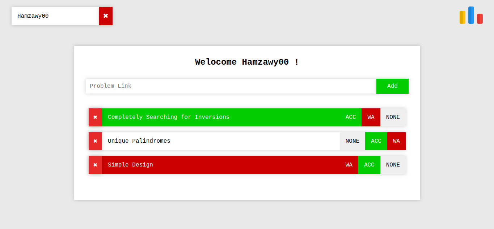

# cp-training-list

[Live Link](https://hamza-cp-training-list.netlify.app/)

### How to use The application:

- First, on the top left input form You can chose to add your codeforces handle or not.
- Second, you can add URL of any problem from Codeforces Problemset.
- If you added a handle then the state of the problem will be initalized to the verdict of the problem for your handle (It can be later overriden by the user).

